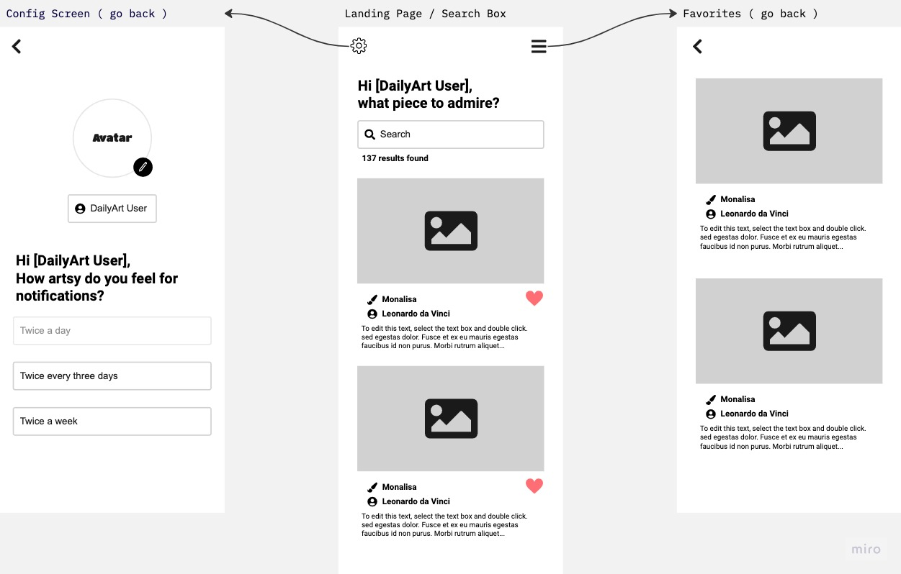

# flutter-sample-app
Sample Flutter App

### MacOS setup 
https://docs.flutter.dev/get-started/install/macos

`flutter doctor`

`open -a Simulator`

`flutter run`

### Next steps...
https://www.youtube.com/watch?v=ZHdg2kfKmjI&ab_channel=JohannesMilke
https://github.com/JohannesMilke/search_filter_listview
https://karthikponnam.medium.com/flutter-search-in-listview-1ffa40956685

### Miro model

